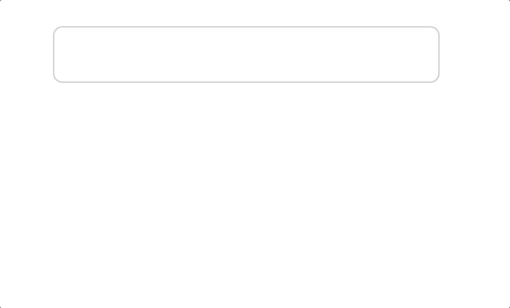
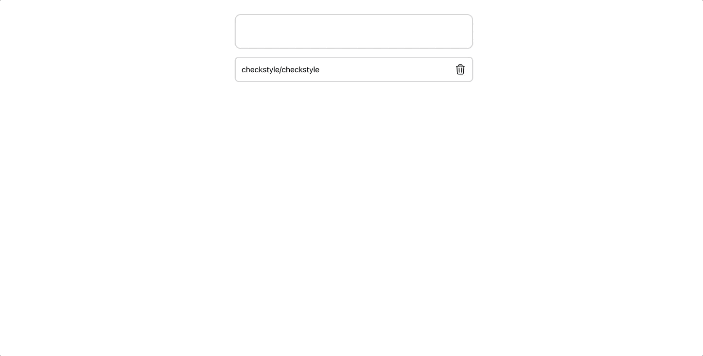
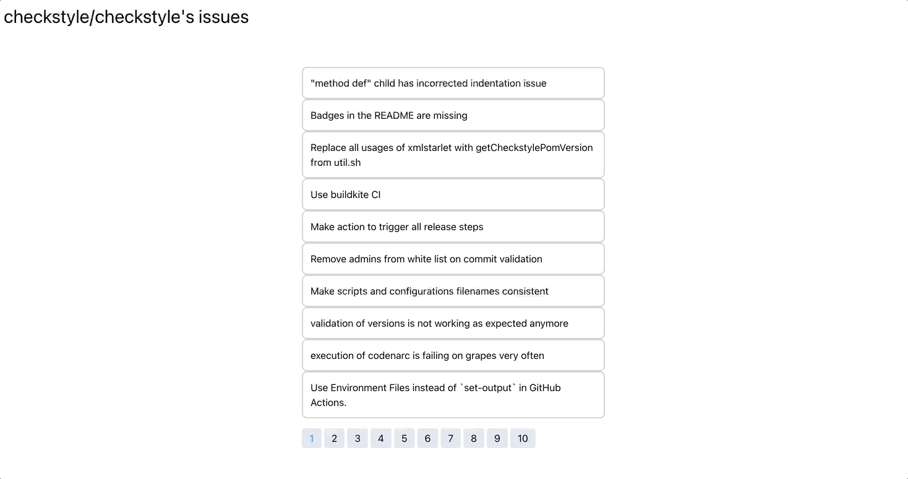

## 프론트엔드 엔지니어 과제 연습

### 요구사항

> ✅: 개발 완료 ⚠️: 일부 완료

1. 검색창에 Repository명을 입력해서 Repository를 검색할 수 있다. ✅
2. 검색된 Public Repository를 등록할 수 있다. ✅
   - 등록 개수는 최대 4개로 제한하며, 최대 개수 초과 등록 시 이를 사용자에게 알려준다. ✅
   - 웹은 LocalStorage, 앱은 Async Storage 등 로컬 저장소를 활용한다. (웹 혹은 앱 선택) ✅
3. 등록된 Repository를 삭제할 수 있다. ✅
4. 등록된 각각의 Public Repository의 issue를 한 페이지에서 모아서 볼 수 있다. ⚠️
   - 각 issue 마다 제목, Repository 명은 필수로 표현되어야 한다. 그 이외의 데이터 중 필요하다고 생각되는 부분은 추가한다. ⚠️
   - 해당 issue를 클릭하면 Github의 상세 페이지로 이동할 수 있다. ✅
   - 페이지네이션을 통해서 계속해서 issue를 모아서 볼 수 있다. ✅

### 요구사항 미충족 내용

요구사항을 파악하지 못하여 4번에서 등록된 전체 Public Repository의 issue를 한 페이지에서 볼 수 있는 사항을 등록된 Public Repository를 선택하면, 선택한 Public Repository의 issue만 보이도록 개발했습니다.

---

### 프로젝트 설정 방법

- Node.js 버전은 **16.13.0** 이상으로 필요해요.
- 해당 Repository를 clone 해주세요.
- 프로젝트의 터미널에서 `npm install` 명령어를 입력하여 관련 의존성 파일을 설치해주세요.
- `npm run start` 명령어를 입력하여 로컬 서버로 구동시킬 수 있어요.
- 프로젝트 구축이 귀찮으시다면 [배포 링크](https://wani-payhere-challenge.netlify.app/)를 클릭하시면 확인할 수 있어요.

---

### 기능 소개

1. Public Repository 조회와 등록을 할 수 있어요.
   

2. 등록한 Public Repository의 이슈 사항을 확인할 수 있어요.
   

3. 선택한 Repository의 이슈를 페이지 단위로 볼 수 있어요.
   

---

### 고민 거리

1. CRA(Create React App) vs Vite  
   프로젝트를 스캐폴딩 할 때 어느 도구를 써야 할지 고민했어요.
   |CRA|Vite|
   |-|-|
   |개발에 필요한 라이브러리가 다 포함되어 있어서 빠르게 초기 설정이 가능|원하는 라이브러리를 직접 설치하여 필요한 부분만 커스텀|
   |Webpack 기반이라 번들링 속도가 상대적으로 느림|번들링 속도가 빠름|

   소규모 프로젝트이고 초기 설정을 빠르게 해야겠다는 필요성을 근거로 **CRA**로 구축했어요.

2. CSS Module vs Styled Component vs Tailwind  
   |CSS Module | Styled Component | Tailwind|
   |-|-|-|
   |순수 CSS로 개발할 수 있으며 독립적으로 CSS를 제공하여 네이밍이 자유로움|JS로 CSS를 표현할 수 있음| 이미 정의된 디자인 시스템의 클래스를 활용할 수 있음|

   CSS Module과 Tailwind 둘 중에 고민했지만, 빠르게 디자인을 구현할 수 있는 장점을 근거로 **Tailwind**를 선택했어요.
